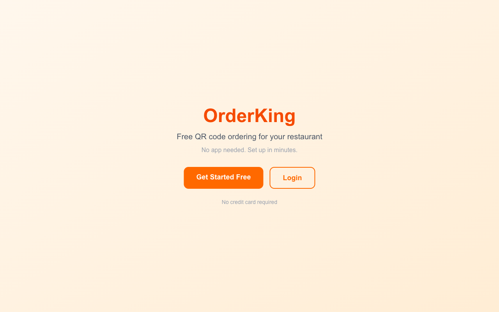
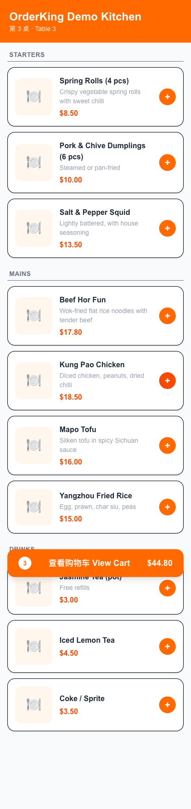
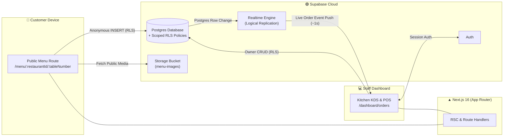

# 🍽️ SERVÉ — Restaurant OS

<p align="center">
  
</p>

<p align="center">
  <b>A modern, full-stack QR ordering & Point-of-Sale (POS) SaaS platform for restaurants.</b><br />
  Diners scan table QR codes to order directly from their browser — no app installation required. Orders stream live to the kitchen dashboard in real time.
</p>

<p align="center">
  
  
  
  
  
</p>

---

## 📸 Screenshots & Showcase

| 📱 Mobile Diner Menu | 💻 Live Kitchen Dashboard | 💳 POS Counter Checkout |
| :---: | :---: | :---: |
|  |  |  |

---

## ✨ Key Features

### 📱 Customer Experience (Dine-In)
- **Zero-Friction QR Ordering**: Diners scan a table QR code and view the menu immediately inside any mobile browser. No app download required.
- **Categorized Menu & Special Requests**: Browse dishes by category with crisp photos, pricing, and add custom item notes (e.g. *"No onions, extra sauce"*).
- **Cart & Order Tracking**: Instant item total calculations and smooth order submission straight to the kitchen.

### 💻 Kitchen & Staff Dashboard
- **Real-Time Order Push**: New orders arrive instantaneously without manual page refreshes, powered by Supabase Realtime (Postgres logical replication).
- **Audible Alerts**: Configurable chime/beep notification triggers when a new order arrives.
- **Dine-In & Takeaway Management**: Separate or view unified queues. Auto-generates takeaway tickets (`T01`, `T02`...) for walk-in takeaway orders.
- **Table Bill Merging**: Group multiple orders placed on the same physical table into a consolidated bill for checkout.

### 🧾 POS & Counter Operations
- **Multi-Method Payment Support**: Process Cash, Card, or Direct Transfer transactions.
- **Automated Surcharges**: Configurable card surcharge percentages and one-click Public Holiday (PH) surcharge toggles.
- **Smart Change Calculator**: Instant change calculations with quick-cash bill buttons ($20, $50, $100).
- **Payment Reversals (Undo)**: Accidental payment checkout can be reverted back to *Confirmed* status in one click.
- **Daily Revenue Analytics**: Real-time sales breakdown of today's total revenue split by payment method and collected surcharges.

### 🪑 Operations & Admin Tools
- **Menu Builder**: Full CRUD for menu items and categories. Set price, description, category assignment, and upload images to cloud storage.
- **Stock Availability Toggles**: Toggle items as *Available* or *Unavailable* in real time to prevent diners from ordering sold-out dishes.
- **Printable QR Code Card Generator**: Built-in client-side HTML5 Canvas generator produces high-resolution table card graphics (`Table 1`, `Table 2`...) ready for printing and placement on physical tables.

---

## 🏗️ System Architecture



---

## 🗂️ Database Schema Overview

```
restaurants ──┬──< categories ──< menu_items
              ├──< tables
              └──< orders ──< order_items
```

- `restaurants`: Stores restaurant details, owner link, card surcharge %, public holiday surcharge %, and active toggles.
- `categories`: Menu categories sorted by custom display order.
- `menu_items`: Dish names, descriptions, prices, image URLs, category links, and availability status.
- `tables`: Physical table numbers associated with a restaurant.
- `orders`: Tracks table numbers or takeaway identifiers (`T01`), status (`pending`, `confirmed`, `ready`, `paid`), totals, surcharges, payment methods, and timestamps.
- `order_items`: Line items linked to orders capturing snapshots of item names, prices, and quantities at order time.

---

## 🚀 Getting Started

### 1. Prerequisites
- **Node.js**: v18.x or higher
- **npm**: v9.x or higher
- **Supabase Account**: A free Supabase project at [supabase.com](https://supabase.com)

### 2. Installation & Setup

```bash
# Clone the repository
git clone https://github.com/JoswinLynel/SERV---Restaurant-OS.git
cd SERV---Restaurant-OS

# Install dependencies
npm install
```

### 3. Environment Configuration

Create a `.env.local` file in the project root:

```env
NEXT_PUBLIC_SUPABASE_URL=https://your-project-ref.supabase.co
NEXT_PUBLIC_SUPABASE_ANON_KEY=your-anon-public-key
```

### 4. Database Initialization

1. Open your Supabase Project SQL Editor.
2. Run the complete schema script: [`supabase-schema.sql`](supabase-schema.sql)
3. *(Optional)* Run the demo seed dataset script: [`seed-demo.sql`](seed-demo.sql)
4. Ensure a public Storage bucket named `menu-images` is created in Supabase.

### 5. Run Locally

```bash
npm run dev
```

Open [http://localhost:3000](http://localhost:3000) in your browser.

---

## 📄 License

Distributed under the MIT License. See [`LICENSE`](LICENSE) for more information.
